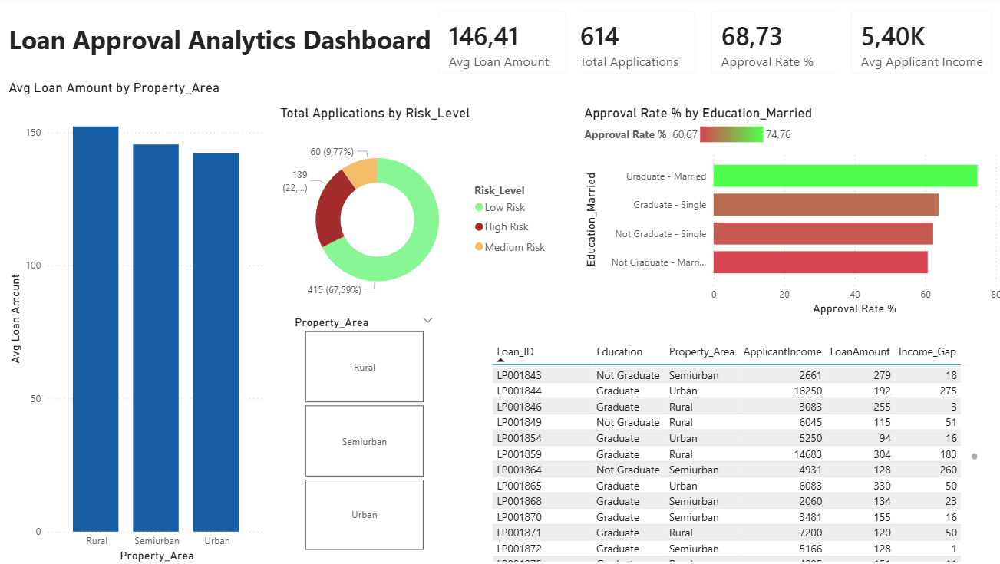

# Loan Approval Analytics Dashboard

SQL analysis and Power BI dashboard for loan approval prediction on a 614-record applicant dataset.

## Project Overview

This project analyzes loan application data to identify approval patterns across customer segments and risk factors. It combines SQL data analysis with an interactive Power BI dashboard, demonstrating both data engineering query skills and BI visualization.

## Tech Stack

- **MySQL** — data storage and SQL analysis
- **Power BI Desktop** — dashboard and visualizations
- **DAX** — calculated columns, measures, and window function simulation

## Dataset

Loan prediction dataset:
- 614 loan applications
- Features: demographics (gender, marital status, education, dependents), income, loan amount, credit history, property area, loan status

## Analysis Questions

1. **Approval rate by Education and Marital Status** — which combinations have highest approval
2. **Average loan amount by Property Area** — geographic loan distribution
3. **Risk segmentation** — Low/Medium/High based on Credit_History and LoanAmount
4. **Income gap analysis** — using SQL `LAG()` window function to identify income disparities within education groups (replicated in DAX)

## Key Insights

- Graduate-Married applicants have ~75% approval rate (highest)
- Not Graduate-Married have ~61% approval rate (lowest)
- 67% of applicants are Low Risk, 23% High Risk, 10% Medium Risk
- Rural areas have highest average loan amounts
- Income gaps within education groups reach up to 17K+ between top earners

## DAX Highlight

Visual 4 replicates SQL `LAG() OVER (PARTITION BY Education ORDER BY ApplicantIncome DESC)` using a calculated column with `CALCULATE` + `FILTER` + `MIN` to find the next-highest income within each education group.

## Files

- `loan_data.sql` — SQL queries for all 4 analysis questions (CTEs, window functions, aggregations)
- `Loan_dataBI.pbix` — Power BI dashboard file
- `Loan_data_image.webp` — preview of the dashboard

## Dashboard Preview

## Author

Georgi Terziev — [LinkedIn](https://www.linkedin.com/in/georgi-terziev-7980b4403/)
